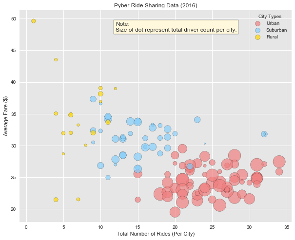
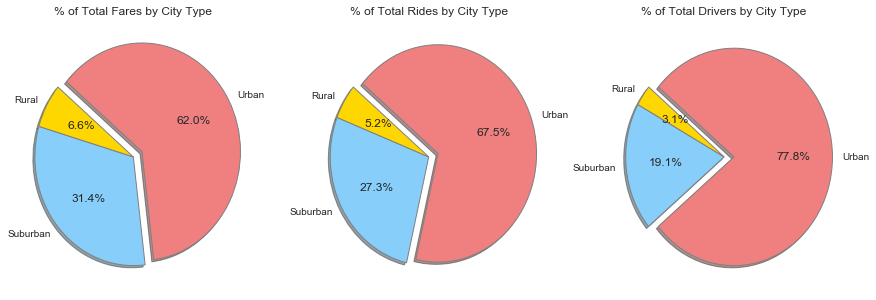

## Analysis
1. Urban area has largest number of rides
2. Urban area has biggest number of drivers
3. Rurual area has fewest number of rides but higest average fares

## Imports and Constants


```python
import os
from collections import OrderedDict
import pandas as pd
import matplotlib.pyplot as plt
import seaborn as sns

sns.set()
sns.set_style('darkgrid', {'axes.facecolor': '0.9'})

# Use below data structus to facliate coloring
COLOR_MAP = OrderedDict([
    ('Urban', 'lightcoral'),
    ('Suburban', 'lightskyblue'),
    ('Rural', 'gold')
    ]
)
COLORS = [COLOR_MAP[t] for t in COLOR_MAP]
TYPES = [t for t in COLOR_MAP]
```

## Prepare Data


```python
city_file = os.path.join('raw_data', 'city_data.csv')
df_city = pd.read_csv(city_file)
df_city.head()
```


<div>
<style>
    .dataframe thead tr:only-child th {
        text-align: right;
    }

    .dataframe thead th {
        text-align: left;
    }

    .dataframe tbody tr th {
        vertical-align: top;
    }
</style>
<table border="1" class="dataframe">
  <thead>
    <tr style="text-align: right;">
      <th></th>
      <th>city</th>
      <th>driver_count</th>
      <th>type</th>
    </tr>
  </thead>
  <tbody>
    <tr>
      <th>0</th>
      <td>Kelseyland</td>
      <td>63</td>
      <td>Urban</td>
    </tr>
    <tr>
      <th>1</th>
      <td>Nguyenbury</td>
      <td>8</td>
      <td>Urban</td>
    </tr>
    <tr>
      <th>2</th>
      <td>East Douglas</td>
      <td>12</td>
      <td>Urban</td>
    </tr>
    <tr>
      <th>3</th>
      <td>West Dawnfurt</td>
      <td>34</td>
      <td>Urban</td>
    </tr>
    <tr>
      <th>4</th>
      <td>Rodriguezburgh</td>
      <td>52</td>
      <td>Urban</td>
    </tr>
  </tbody>
</table>
</div>


```python
ride_file = os.path.join('raw_data', 'ride_data.csv')
df_ride = pd.read_csv(ride_file)
df_ride.head()
```


<div>
<style>
    .dataframe thead tr:only-child th {
        text-align: right;
    }

    .dataframe thead th {
        text-align: left;
    }

    .dataframe tbody tr th {
        vertical-align: top;
    }
</style>
<table border="1" class="dataframe">
  <thead>
    <tr style="text-align: right;">
      <th></th>
      <th>city</th>
      <th>date</th>
      <th>fare</th>
      <th>ride_id</th>
    </tr>
  </thead>
  <tbody>
    <tr>
      <th>0</th>
      <td>Sarabury</td>
      <td>2016-01-16 13:49:27</td>
      <td>38.35</td>
      <td>5403689035038</td>
    </tr>
    <tr>
      <th>1</th>
      <td>South Roy</td>
      <td>2016-01-02 18:42:34</td>
      <td>17.49</td>
      <td>4036272335942</td>
    </tr>
    <tr>
      <th>2</th>
      <td>Wiseborough</td>
      <td>2016-01-21 17:35:29</td>
      <td>44.18</td>
      <td>3645042422587</td>
    </tr>
    <tr>
      <th>3</th>
      <td>Spencertown</td>
      <td>2016-07-31 14:53:22</td>
      <td>6.87</td>
      <td>2242596575892</td>
    </tr>
    <tr>
      <th>4</th>
      <td>Nguyenbury</td>
      <td>2016-07-09 04:42:44</td>
      <td>6.28</td>
      <td>1543057793673</td>
    </tr>
  </tbody>
</table>
</div>


### Merge Two Data Sets
Before merging ride data into city, summarize it first to avoid double couning of rides.


```python
df_city = df_city.merge(
    df_ride.groupby('city')[['fare', 'ride_id']].agg(
        {
            'fare': 'mean',
            'ride_id': 'count',
        }
    ).reset_index().rename(
        columns={
             'fare': 'fare_average',
             'ride_id': 'ride_count',
        }
    ),
    on='city',
    how='left'
)
df_city.head()
```


<div>
<style>
    .dataframe thead tr:only-child th {
        text-align: right;
    }

    .dataframe thead th {
        text-align: left;
    }

    .dataframe tbody tr th {
        vertical-align: top;
    }
</style>
<table border="1" class="dataframe">
  <thead>
    <tr style="text-align: right;">
      <th></th>
      <th>city</th>
      <th>driver_count</th>
      <th>type</th>
      <th>fare_average</th>
      <th>ride_count</th>
    </tr>
  </thead>
  <tbody>
    <tr>
      <th>0</th>
      <td>Kelseyland</td>
      <td>63</td>
      <td>Urban</td>
      <td>21.806429</td>
      <td>28</td>
    </tr>
    <tr>
      <th>1</th>
      <td>Nguyenbury</td>
      <td>8</td>
      <td>Urban</td>
      <td>25.899615</td>
      <td>26</td>
    </tr>
    <tr>
      <th>2</th>
      <td>East Douglas</td>
      <td>12</td>
      <td>Urban</td>
      <td>26.169091</td>
      <td>22</td>
    </tr>
    <tr>
      <th>3</th>
      <td>West Dawnfurt</td>
      <td>34</td>
      <td>Urban</td>
      <td>22.330345</td>
      <td>29</td>
    </tr>
    <tr>
      <th>4</th>
      <td>Rodriguezburgh</td>
      <td>52</td>
      <td>Urban</td>
      <td>21.332609</td>
      <td>23</td>
    </tr>
  </tbody>
</table>
</div>


## Bubble Plot of Ride Sharing Data

__Note__: When plotting the size is multiplied by 10 to show more apparent differences.


```python
fig, ax = plt.subplots(figsize=(10, 8))

# Multiply side by 10 to see differences easier
handles = [
    ax.scatter(
        s=df_city[df_city['type'] == type]['driver_count'] * 10,
        x=df_city[df_city['type'] == type]['ride_count'],
        y=df_city[df_city['type'] == type]['fare_average'],
        alpha=0.7,
        label=type,
        edgecolor='black',
        color=COLOR_MAP[type],
    ) for type in df_city['type'].unique()
]

ax.legend(
    handles=handles,
    title='City Types',
    loc='best',

)

ax.text(37, 40, 'Note:\nSize of dot represent total driver count per city.',
         fontsize=12,
         bbox=dict(facecolor='cornsilk'))

plt.title('Pyber Ride Sharing Data (2016)')
plt.xlabel('Total Number of Rides (Per City)')
plt.ylabel('Average Fare ($)')

plt.show()
```





## Total Fares by City Type

### Compute Total Fares for Each City
This data set can be used on all below three pie charts. Note here that total fare is retreived from ride data, instead of computed by fare average multiply by ride count to preserer precision.


```python
df_city = df_city.merge(
    df_ride.groupby('city')['fare'].sum(
    ).to_frame().reset_index().rename(
        columns={
             'fare': 'fare_total',
        }
    ),
    on='city',
    how='left'
)
df_city.head()
```


<div>
<style>
    .dataframe thead tr:only-child th {
        text-align: right;
    }

    .dataframe thead th {
        text-align: left;
    }

    .dataframe tbody tr th {
        vertical-align: top;
    }
</style>
<table border="1" class="dataframe">
  <thead>
    <tr style="text-align: right;">
      <th></th>
      <th>city</th>
      <th>driver_count</th>
      <th>type</th>
      <th>fare_average</th>
      <th>ride_count</th>
      <th>fare_total</th>
    </tr>
  </thead>
  <tbody>
    <tr>
      <th>0</th>
      <td>Kelseyland</td>
      <td>63</td>
      <td>Urban</td>
      <td>21.806429</td>
      <td>28</td>
      <td>610.58</td>
    </tr>
    <tr>
      <th>1</th>
      <td>Nguyenbury</td>
      <td>8</td>
      <td>Urban</td>
      <td>25.899615</td>
      <td>26</td>
      <td>673.39</td>
    </tr>
    <tr>
      <th>2</th>
      <td>East Douglas</td>
      <td>12</td>
      <td>Urban</td>
      <td>26.169091</td>
      <td>22</td>
      <td>575.72</td>
    </tr>
    <tr>
      <th>3</th>
      <td>West Dawnfurt</td>
      <td>34</td>
      <td>Urban</td>
      <td>22.330345</td>
      <td>29</td>
      <td>647.58</td>
    </tr>
    <tr>
      <th>4</th>
      <td>Rodriguezburgh</td>
      <td>52</td>
      <td>Urban</td>
      <td>21.332609</td>
      <td>23</td>
      <td>490.65</td>
    </tr>
  </tbody>
</table>
</div>


### Plot Pie Charts


```python
PIE_STYLE = {
    'startangle': 140,
    'explode': [0.1, 0, 0],
    'shadow': True,
    'pctdistance': 0.6,
    'autopct': '%1.1f%%',
    'colors': COLORS,
    'labels': TYPES,
    'counterclock': False,
    'wedgeprops': {'linewidth': 1, 'edgecolor': 'grey'}
}

fig, ax = plt.subplots(3, 1, figsize=(15, 5))
plt.suptitle("Total fare, ride and drivers by city type")

plt.subplot(131)
plt.title('% of Total Fares by City Type')
plt.pie(
    df_city.groupby('type')['fare_total'].sum()[TYPES], 
    **PIE_STYLE
)

plt.subplot(132)
plt.title('% of Total Rides by City Type')
plt.pie(
    df_city.groupby('type')['ride_count'].sum()[TYPES],
    **PIE_STYLE
)

plt.subplot(133)
plt.title('% of Total Drivers by City Type')
plt.pie(
    df_city.groupby('type')['driver_count'].sum()[TYPES], 
    **PIE_STYLE
)

plt.show()
```




