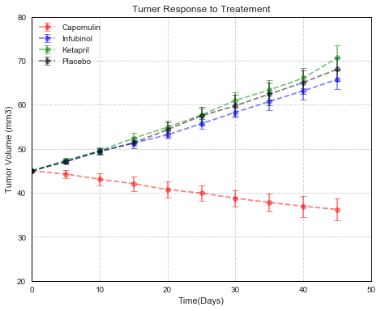
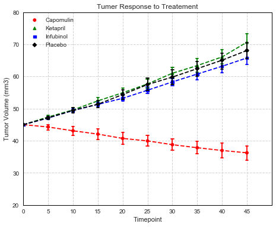
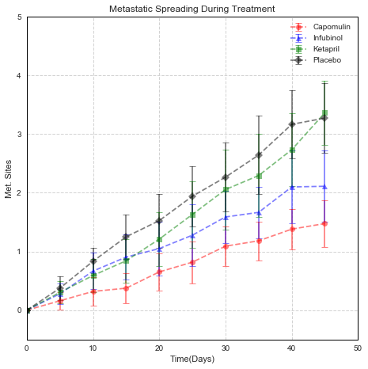
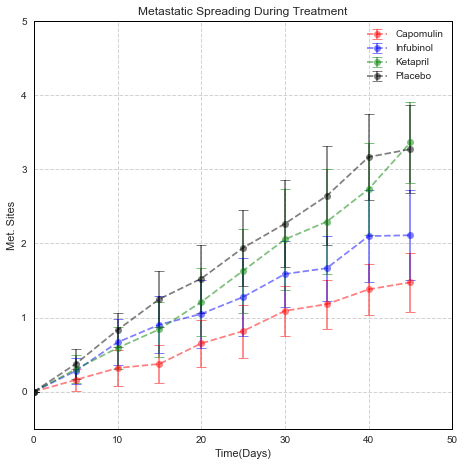
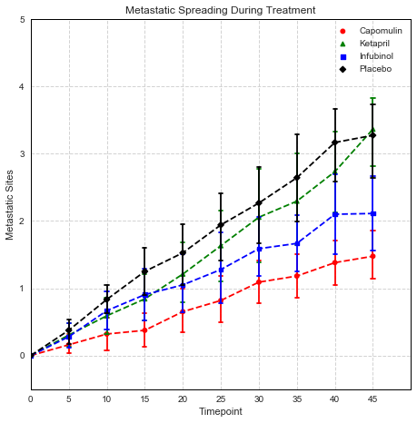
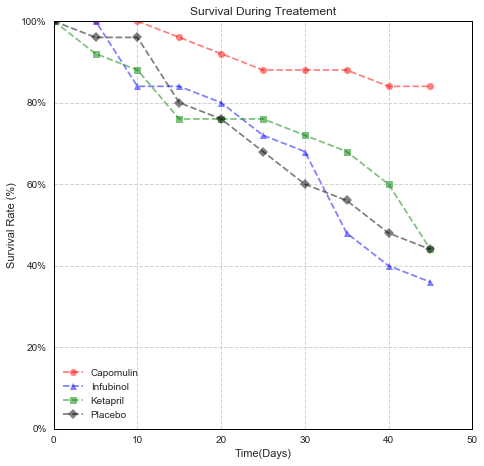

## Aanlysis

1. Only one drug, Capomulin, amoung the four in the chart had positive effect on reduce the tumor size, and better survival rate among four. Others does not show significant difference from the placebo.
2. Metastatic Spread has a significant large standard error. More analysis is needed to proof the hypothesis for any drug is better on this aspect than others.
3. Standard error for all parameters grow with time

## Imports and Constants


```python
import os
from collections import OrderedDict
import numpy as np
import pandas as pd
import matplotlib.pyplot as plt
import seaborn as sns

sns.set()
sns.set_style('whitegrid', {
    'axes.edgecolor': 'black',
    'grid.color': 'lightgrey',
    }
)

# Predefined Marker, LineStyle and Colors
COLORS = ['red', 'blue', 'green', 'black']
SHARED_CONFIG = dict(linestyle='--', alpha=0.5)
DRUGS_CONFIG = OrderedDict( [
    ('Capomulin', dict(marker='o', color='red')), 
    ('Infubinol', dict(marker='^', color='blue')),
    ('Ketapril', dict(marker='s', color='green')),
    ('Placebo',  dict(marker='D', color='black'))
    ]
)
DRUGS = [x for x in DRUGS_CONFIG]

```

## Prepare Data

### Merge two data sets


```python
df_clinical_trial = pd.read_csv(
    os.path.join('raw_data', 'clinicaltrial_data.csv')
)
df_clinical_trial.head()
```


<div>
<style>
    .dataframe thead tr:only-child th {
        text-align: right;
    }

    .dataframe thead th {
        text-align: left;
    }

    .dataframe tbody tr th {
        vertical-align: top;
    }
</style>
<table border="1" class="dataframe">
  <thead>
    <tr style="text-align: right;">
      <th></th>
      <th>Mouse ID</th>
      <th>Timepoint</th>
      <th>Tumor Volume (mm3)</th>
      <th>Metastatic Sites</th>
    </tr>
  </thead>
  <tbody>
    <tr>
      <th>0</th>
      <td>b128</td>
      <td>0</td>
      <td>45.0</td>
      <td>0</td>
    </tr>
    <tr>
      <th>1</th>
      <td>f932</td>
      <td>0</td>
      <td>45.0</td>
      <td>0</td>
    </tr>
    <tr>
      <th>2</th>
      <td>g107</td>
      <td>0</td>
      <td>45.0</td>
      <td>0</td>
    </tr>
    <tr>
      <th>3</th>
      <td>a457</td>
      <td>0</td>
      <td>45.0</td>
      <td>0</td>
    </tr>
    <tr>
      <th>4</th>
      <td>c819</td>
      <td>0</td>
      <td>45.0</td>
      <td>0</td>
    </tr>
  </tbody>
</table>
</div>


```python
df_mouse_drug = pd.read_csv(
    os.path.join('raw_data', 'mouse_drug_data.csv')
)
df_mouse_drug.head()
```


<div>
<style>
    .dataframe thead tr:only-child th {
        text-align: right;
    }

    .dataframe thead th {
        text-align: left;
    }

    .dataframe tbody tr th {
        vertical-align: top;
    }
</style>
<table border="1" class="dataframe">
  <thead>
    <tr style="text-align: right;">
      <th></th>
      <th>Mouse ID</th>
      <th>Drug</th>
    </tr>
  </thead>
  <tbody>
    <tr>
      <th>0</th>
      <td>f234</td>
      <td>Stelasyn</td>
    </tr>
    <tr>
      <th>1</th>
      <td>x402</td>
      <td>Stelasyn</td>
    </tr>
    <tr>
      <th>2</th>
      <td>a492</td>
      <td>Stelasyn</td>
    </tr>
    <tr>
      <th>3</th>
      <td>w540</td>
      <td>Stelasyn</td>
    </tr>
    <tr>
      <th>4</th>
      <td>v764</td>
      <td>Stelasyn</td>
    </tr>
  </tbody>
</table>
</div>


```python
df_combo = df_clinical_trial.merge(
    df_mouse_drug,
    on='Mouse ID',
    how='outer'
)

df_combo.head()
```


<div>
<style>
    .dataframe thead tr:only-child th {
        text-align: right;
    }

    .dataframe thead th {
        text-align: left;
    }

    .dataframe tbody tr th {
        vertical-align: top;
    }
</style>
<table border="1" class="dataframe">
  <thead>
    <tr style="text-align: right;">
      <th></th>
      <th>Mouse ID</th>
      <th>Timepoint</th>
      <th>Tumor Volume (mm3)</th>
      <th>Metastatic Sites</th>
      <th>Drug</th>
    </tr>
  </thead>
  <tbody>
    <tr>
      <th>0</th>
      <td>b128</td>
      <td>0</td>
      <td>45.000000</td>
      <td>0</td>
      <td>Capomulin</td>
    </tr>
    <tr>
      <th>1</th>
      <td>b128</td>
      <td>5</td>
      <td>45.651331</td>
      <td>0</td>
      <td>Capomulin</td>
    </tr>
    <tr>
      <th>2</th>
      <td>b128</td>
      <td>10</td>
      <td>43.270852</td>
      <td>0</td>
      <td>Capomulin</td>
    </tr>
    <tr>
      <th>3</th>
      <td>b128</td>
      <td>15</td>
      <td>43.784893</td>
      <td>0</td>
      <td>Capomulin</td>
    </tr>
    <tr>
      <th>4</th>
      <td>b128</td>
      <td>20</td>
      <td>42.731552</td>
      <td>0</td>
      <td>Capomulin</td>
    </tr>
  </tbody>
</table>
</div>


## Tumor Response to Treatement

 ### Compute Mean Values


```python
df_tumor_mean = df_combo.pivot_table(
    values='Tumor Volume (mm3)',
    index='Timepoint',
    columns='Drug'
)[DRUGS]

df_tumor_mean.head()
```


<div>
<style>
    .dataframe thead tr:only-child th {
        text-align: right;
    }

    .dataframe thead th {
        text-align: left;
    }

    .dataframe tbody tr th {
        vertical-align: top;
    }
</style>
<table border="1" class="dataframe">
  <thead>
    <tr style="text-align: right;">
      <th>Drug</th>
      <th>Capomulin</th>
      <th>Infubinol</th>
      <th>Ketapril</th>
      <th>Placebo</th>
    </tr>
    <tr>
      <th>Timepoint</th>
      <th></th>
      <th></th>
      <th></th>
      <th></th>
    </tr>
  </thead>
  <tbody>
    <tr>
      <th>0</th>
      <td>45.000000</td>
      <td>45.000000</td>
      <td>45.000000</td>
      <td>45.000000</td>
    </tr>
    <tr>
      <th>5</th>
      <td>44.266086</td>
      <td>47.062001</td>
      <td>47.389175</td>
      <td>47.125589</td>
    </tr>
    <tr>
      <th>10</th>
      <td>43.084291</td>
      <td>49.403909</td>
      <td>49.582269</td>
      <td>49.423329</td>
    </tr>
    <tr>
      <th>15</th>
      <td>42.064317</td>
      <td>51.296397</td>
      <td>52.399974</td>
      <td>51.359742</td>
    </tr>
    <tr>
      <th>20</th>
      <td>40.716325</td>
      <td>53.197691</td>
      <td>54.920935</td>
      <td>54.364417</td>
    </tr>
  </tbody>
</table>
</div>


### Compute Standard Deviations


```python
df_tumor_std = df_combo.pivot_table(
    values='Tumor Volume (mm3)',
    index='Timepoint',
    columns='Drug',
    aggfunc='std'
)[DRUGS]

df_tumor_std.head()
```


<div>
<style>
    .dataframe thead tr:only-child th {
        text-align: right;
    }

    .dataframe thead th {
        text-align: left;
    }

    .dataframe tbody tr th {
        vertical-align: top;
    }
</style>
<table border="1" class="dataframe">
  <thead>
    <tr style="text-align: right;">
      <th>Drug</th>
      <th>Capomulin</th>
      <th>Infubinol</th>
      <th>Ketapril</th>
      <th>Placebo</th>
    </tr>
    <tr>
      <th>Timepoint</th>
      <th></th>
      <th></th>
      <th></th>
      <th></th>
    </tr>
  </thead>
  <tbody>
    <tr>
      <th>0</th>
      <td>0.000000</td>
      <td>0.000000</td>
      <td>0.000000</td>
      <td>0.000000</td>
    </tr>
    <tr>
      <th>5</th>
      <td>2.242964</td>
      <td>1.175512</td>
      <td>1.270025</td>
      <td>1.068422</td>
    </tr>
    <tr>
      <th>10</th>
      <td>3.513422</td>
      <td>1.293872</td>
      <td>1.676454</td>
      <td>1.969702</td>
    </tr>
    <tr>
      <th>15</th>
      <td>4.108369</td>
      <td>1.639210</td>
      <td>2.529329</td>
      <td>2.747955</td>
    </tr>
    <tr>
      <th>20</th>
      <td>4.362915</td>
      <td>2.129674</td>
      <td>3.166670</td>
      <td>3.659772</td>
    </tr>
  </tbody>
</table>
</div>


### Plot with pylot


```python
fig, ax = plt.subplots(1,1, figsize=(6, 4))

for drug in DRUGS:
    ax.errorbar(
       x=df_tumor_std.index,
       y=df_tumor_mean[drug],
       yerr=df_tumor_std[drug],
       capsize=50,
       **DRUGS_CONFIG[drug],
       **SHARED_CONFIG
       )

ax.legend(loc='best')

plt.xlim((0,45))
plt.ylim((20, 80))
plt.grid(True, linestyle='--')
plt.xlabel('Time(Days)')
plt.ylabel('Tumor Volume (mm3)')
plt.title('Tumer Response to Treatement')
plt.show()
```


### Plot with DataFrame.plot
The limit of this approach is that marker argument does not take a list, even though color take a list of colors, so only one marker can be used. If printed on a B/W printer, this could be a problem.


```python
df_tumor_mean.plot(
    yerr=df_tumor_std[drug],
    capsize=100,
    marker='o',
    color=COLORS,
    **SHARED_CONFIG,
    label='legend',
    xlim=(0, 45),
    ylim=(20, 80),
    figsize=(6,4),
    title='Tumer Response to Treatement',
    )

plt.legend(title='')
plt.grid(True, linestyle='--')
plt.xlabel('Time(Days)')
plt.ylabel('Tumor Volume (mm3)')
plt.show()
```





### Plot with Seaborn pointplot
Searborn's point_point() method take detail level data direclty and draw error bar automatically. Also it is highly configurable. However, I cannot figure out from the document and Googling, the way to set alpha for the line. There is an un-answered stack overflow post: https://stackoverflow.com/questions/33486613/seaborn-pointplot-aesthetics?rq=1


```python
fig, ax = plt.subplots(1,1, figsize=(6, 4))

sns.pointplot(
    x="Timepoint", 
    y="Tumor Volume (mm3)", 
    hue="Drug", 
    data=df_combo[df_combo['Drug'].isin(DRUGS)],
    palette={drug: DRUGS_CONFIG[drug]['color'] for drug in DRUGS},
    markers=[DRUGS_CONFIG[drug]['marker'] for drug in DRUGS],
    linestyles=['--' for _ in DRUGS],
    ax=ax,
    capsize=0.1,
   
);
ax.legend(title='')
ax.grid(True, linestyle='--')
ax.set_title('Tumer Response to Treatement')
ax.set_alpha(0.5)
plt.show()
```





## Metastatic Response to Treatment

### Compute Mean Values


```python
df_metastatic_mean = df_combo.pivot_table(
    values='Metastatic Sites',
    index='Timepoint',
    columns='Drug'
)[DRUGS]

df_metastatic_mean.head()
```


<div>
<style>
    .dataframe thead tr:only-child th {
        text-align: right;
    }

    .dataframe thead th {
        text-align: left;
    }

    .dataframe tbody tr th {
        vertical-align: top;
    }
</style>
<table border="1" class="dataframe">
  <thead>
    <tr style="text-align: right;">
      <th>Drug</th>
      <th>Capomulin</th>
      <th>Infubinol</th>
      <th>Ketapril</th>
      <th>Placebo</th>
    </tr>
    <tr>
      <th>Timepoint</th>
      <th></th>
      <th></th>
      <th></th>
      <th></th>
    </tr>
  </thead>
  <tbody>
    <tr>
      <th>0</th>
      <td>0.000000</td>
      <td>0.000000</td>
      <td>0.000000</td>
      <td>0.000000</td>
    </tr>
    <tr>
      <th>5</th>
      <td>0.160000</td>
      <td>0.280000</td>
      <td>0.304348</td>
      <td>0.375000</td>
    </tr>
    <tr>
      <th>10</th>
      <td>0.320000</td>
      <td>0.666667</td>
      <td>0.590909</td>
      <td>0.833333</td>
    </tr>
    <tr>
      <th>15</th>
      <td>0.375000</td>
      <td>0.904762</td>
      <td>0.842105</td>
      <td>1.250000</td>
    </tr>
    <tr>
      <th>20</th>
      <td>0.652174</td>
      <td>1.050000</td>
      <td>1.210526</td>
      <td>1.526316</td>
    </tr>
  </tbody>
</table>
</div>


### Compute Standard Deviations


```python
df_metastatic_std = df_combo.pivot_table(
    values='Metastatic Sites',
    index='Timepoint',
    columns='Drug',
    aggfunc='std'
)[DRUGS]

df_metastatic_std.head()
```


<div>
<style>
    .dataframe thead tr:only-child th {
        text-align: right;
    }

    .dataframe thead th {
        text-align: left;
    }

    .dataframe tbody tr th {
        vertical-align: top;
    }
</style>
<table border="1" class="dataframe">
  <thead>
    <tr style="text-align: right;">
      <th>Drug</th>
      <th>Capomulin</th>
      <th>Infubinol</th>
      <th>Ketapril</th>
      <th>Placebo</th>
    </tr>
    <tr>
      <th>Timepoint</th>
      <th></th>
      <th></th>
      <th></th>
      <th></th>
    </tr>
  </thead>
  <tbody>
    <tr>
      <th>0</th>
      <td>0.000000</td>
      <td>0.000000</td>
      <td>0.000000</td>
      <td>0.000000</td>
    </tr>
    <tr>
      <th>5</th>
      <td>0.374166</td>
      <td>0.458258</td>
      <td>0.470472</td>
      <td>0.494535</td>
    </tr>
    <tr>
      <th>10</th>
      <td>0.627163</td>
      <td>0.730297</td>
      <td>0.666125</td>
      <td>0.564660</td>
    </tr>
    <tr>
      <th>15</th>
      <td>0.646899</td>
      <td>0.889087</td>
      <td>0.834210</td>
      <td>0.850696</td>
    </tr>
    <tr>
      <th>20</th>
      <td>0.775107</td>
      <td>1.050063</td>
      <td>1.031662</td>
      <td>1.020263</td>
    </tr>
  </tbody>
</table>
</div>


### Plot with pyplot


```python
fig, ax = plt.subplots(1,1, figsize=(6, 4))

"""
plt.legend(
    handles=[
        plt.plot(
            df_metastatic_mean[drug],
            **DRUGS_CONFIG[drug],
            **SHARED_CONFIG
        )[0] for drug in DRUGS
    ]
)
"""

for drug in DRUGS:
    plt.errorbar(
       x=df_metastatic_std.index,
       y=df_metastatic_mean[drug],
       yerr=df_metastatic_std[drug],
       capsize=4,
       **DRUGS_CONFIG[drug],
       **SHARED_CONFIG
       )

ax.legend(loc='best')

plt.xlim((0, 45))
plt.ylim((-0.5, 5))
plt.grid(True, linestyle='--')
plt.xlabel('Time(Days)')
plt.ylabel('Met. Sites')
plt.title('Metastatic Spreading During Treatment')
plt.show()
```





### Plot with DataFrame.plot
Looks like when plotting with DataFrame the error bar size is different from the size using Pyplot. This is kind of strange. Not sure it is a bug or there is some control factor not been set correctly.


```python
fig, ax = plt.subplots(1,1, figsize=(6, 4))

df_metastatic_mean.plot(
    yerr=df_metastatic_std[drug],
    capsize=4,
    marker='o',
    color=COLORS,
    **SHARED_CONFIG,
    xlim=(0, 45),
    ylim=(-0.5, 5),
    title='Metastatic Spreading During Treatment',
    ax=ax,
)

plt.legend(title='')
plt.grid(True, linestyle='--')
plt.xlabel('Time(Days)')
plt.ylabel('Met. Sites')
plt.show()
```





### Plot with Seaborn pointplot


```python
fig, ax = plt.subplots(1,1, figsize=(6, 4))

sns.pointplot(
    x="Timepoint", 
    y="Metastatic Sites", 
    hue="Drug", 
    data=df_combo[df_combo['Drug'].isin(DRUGS)],
    palette={drug: DRUGS_CONFIG[drug]['color'] for drug in DRUGS},
    markers=[DRUGS_CONFIG[drug]['marker'] for drug in DRUGS],
    linestyles=['--' for _ in DRUGS],
    ax=ax,
    capsize=0.1,
   
);
ax.legend(title='')
ax.grid(True, linestyle='--')
ax.set_title('Metastatic Spreading During Treatment')
ax.set_alpha(0.5)
plt.show()
```





## Survival Rates

### Computer Numbers of Survived Mice


```python
df_mouse_count = df_combo.pivot_table(
    values='Mouse ID',
    index='Timepoint',
    columns='Drug',
    aggfunc='count'
)[DRUGS]

df_mouse_count.head()
```


<div>
<style>
    .dataframe thead tr:only-child th {
        text-align: right;
    }

    .dataframe thead th {
        text-align: left;
    }

    .dataframe tbody tr th {
        vertical-align: top;
    }
</style>
<table border="1" class="dataframe">
  <thead>
    <tr style="text-align: right;">
      <th>Drug</th>
      <th>Capomulin</th>
      <th>Infubinol</th>
      <th>Ketapril</th>
      <th>Placebo</th>
    </tr>
    <tr>
      <th>Timepoint</th>
      <th></th>
      <th></th>
      <th></th>
      <th></th>
    </tr>
  </thead>
  <tbody>
    <tr>
      <th>0</th>
      <td>25</td>
      <td>25</td>
      <td>25</td>
      <td>25</td>
    </tr>
    <tr>
      <th>5</th>
      <td>25</td>
      <td>25</td>
      <td>23</td>
      <td>24</td>
    </tr>
    <tr>
      <th>10</th>
      <td>25</td>
      <td>21</td>
      <td>22</td>
      <td>24</td>
    </tr>
    <tr>
      <th>15</th>
      <td>24</td>
      <td>21</td>
      <td>19</td>
      <td>20</td>
    </tr>
    <tr>
      <th>20</th>
      <td>23</td>
      <td>20</td>
      <td>19</td>
      <td>19</td>
    </tr>
  </tbody>
</table>
</div>


### Compute % Survived Over Time


```python
df_init_mouse_count = df_mouse_count.iloc[0]
df_mouse_perc = 100 * df_mouse_count / df_init_mouse_count
df_mouse_perc.head()
```


<div>
<style>
    .dataframe thead tr:only-child th {
        text-align: right;
    }

    .dataframe thead th {
        text-align: left;
    }

    .dataframe tbody tr th {
        vertical-align: top;
    }
</style>
<table border="1" class="dataframe">
  <thead>
    <tr style="text-align: right;">
      <th>Drug</th>
      <th>Capomulin</th>
      <th>Infubinol</th>
      <th>Ketapril</th>
      <th>Placebo</th>
    </tr>
    <tr>
      <th>Timepoint</th>
      <th></th>
      <th></th>
      <th></th>
      <th></th>
    </tr>
  </thead>
  <tbody>
    <tr>
      <th>0</th>
      <td>100.0</td>
      <td>100.0</td>
      <td>100.0</td>
      <td>100.0</td>
    </tr>
    <tr>
      <th>5</th>
      <td>100.0</td>
      <td>100.0</td>
      <td>92.0</td>
      <td>96.0</td>
    </tr>
    <tr>
      <th>10</th>
      <td>100.0</td>
      <td>84.0</td>
      <td>88.0</td>
      <td>96.0</td>
    </tr>
    <tr>
      <th>15</th>
      <td>96.0</td>
      <td>84.0</td>
      <td>76.0</td>
      <td>80.0</td>
    </tr>
    <tr>
      <th>20</th>
      <td>92.0</td>
      <td>80.0</td>
      <td>76.0</td>
      <td>76.0</td>
    </tr>
  </tbody>
</table>
</div>


### Plot with Pyplot


```python
fig, ax = plt.subplots(1,1, figsize=(6, 4))

handles = [ plt.plot(
            df_mouse_perc[drug],
            **DRUGS_CONFIG[drug],
            **SHARED_CONFIG,
        )[0] for drug in DRUGS ]

ax.legend(
    handles=handles
)

# Set Y Axial format to percentage
ax.get_yaxis().set_major_formatter(plt.FuncFormatter(lambda x, loc: "{:.0f}%".format(int(x))))

plt.xlim((0, 45))
plt.ylim((0, 100))
plt.grid(True, linestyle='--')
plt.xlabel('Time(Days)')
plt.ylabel('Survival Rate (%)')
plt.title('Survival During Treatement')
plt.axis()
plt.show()
```





### Plot with DataFrame.plot


```python
fig, ax = plt.subplots(1,1, figsize=(6, 4))

df_mouse_perc.reset_index().plot.line(
    x='Timepoint',
    y=DRUGS,
    marker='o',
    color=COLORS,
    **SHARED_CONFIG,
    title='Survivial Rate Over Time',
    ax=ax,
)

# Set Y Axial format to percentage
ax.get_yaxis().set_major_formatter(plt.FuncFormatter(lambda x, loc: "{:.0f}%".format(int(x))))
plt.title('Survival During Treatement')
plt.xlabel('Time(Days)')
plt.grid(True, linestyle='--')
plt.ylabel('Survival Rate (%)')
plt.show()
```


## Summary Bar Graph

### Computer Overall % Change of Tumer Volume


```python
tumor_first = df_tumor_mean.iloc[0]
tumor_last = df_tumor_mean.iloc[-1]
tumor_change_perc = 100 * (tumor_last - tumor_first) / tumor_first

tumor_change_perc
```


    Drug
    Capomulin   -19.475303
    Infubinol    46.123472
    Ketapril     57.028795
    Placebo      51.297960
    dtype: float64


### Plot with Pyplot
I've tried using plot method of Series but could not get enough control over on the bar color based on positive/negative sign of the percentage, so stick to use the base Pyplot method.


```python
fig, ax = plt.subplots(1,1, figsize=(6, 4))

ax.bar(
    DRUGS,
    tumor_change_perc,
    align='edge',
    width=0.99,
    edgecolor='k',
    color=['g' if x < 0 else 'r' for x in tumor_change_perc],
    linewidth=1,
    alpha=0.5,
    label=None,   
)[0].axes

plt.xlim(0,4)
plt.title('Tumor Change Over 45 Day Treatment')
plt.grid(True, linestyle='--')
plt.ylabel('% Tumer Volume Change')
plt.xticks(np.arange(0.5, len(DRUGS)), rotation=0)

# Set Y Axial format to percentage
ax.get_yaxis().set_major_formatter(plt.FuncFormatter(lambda x, loc: "{:.0f}%".format(int(x))))

# Add labels
for i in range(len(tumor_change_perc)):
    perc = tumor_change_perc[i]
    if perc > 0:
        ax.text(i + 0.25, 3, '{:.2f}%'.format(perc))
    else:
        ax.text(i + 0.25, -5, '{:.2f}%'.format(perc))
        
plt.show()
```


